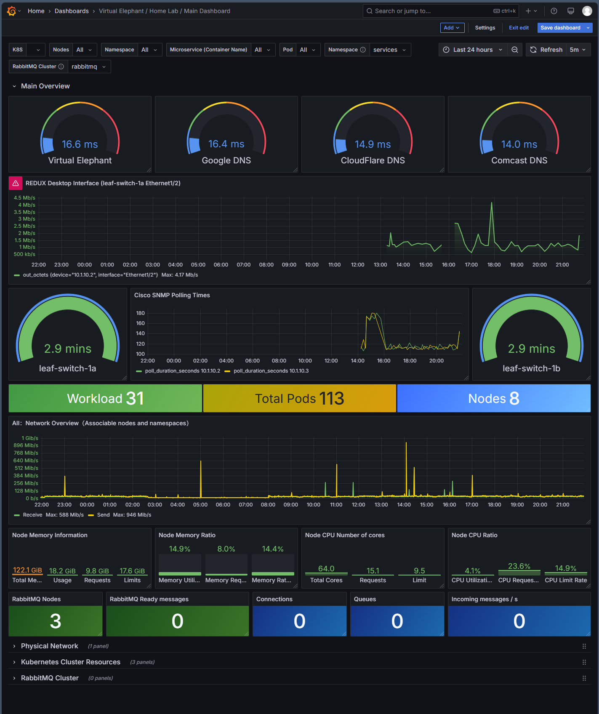
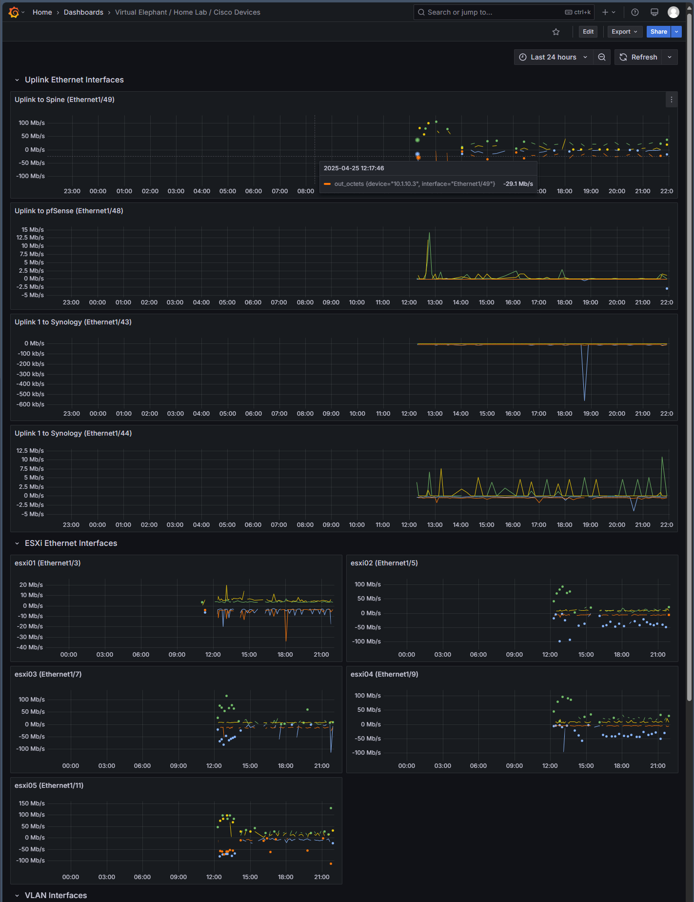

# Grafana Dashboards

Project SignalWave provides a set of dasbhoards that show off the core components of the Kubernetes cluster and the applications running within it. These may need to be modified
based on the container repository you use, as well as panel names based on your physical hardware.

## Main Dashboard

## Cisco Dashboard
